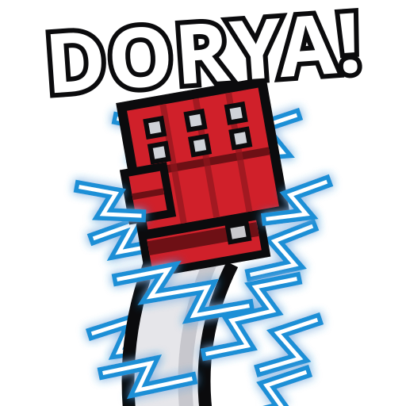

<p align="center"></p>

# Dorya Trainer

**Play it now: https://abduznik.github.io/dorya-trainer/** (free, no install, keyboard or controller)

Dorya Trainer is a browser-based **Electric Wind God Fist trainer** for Tekken players. It teaches the
Mishima **EWGF** (f, n, d, d/f+2) and the **Perfect Electric / PEWGF** (f, n, d/f+2) by sampling your
inputs at a true 60 Hz and telling you, to the frame, whether button 2 landed on the d/f frame. Built
with Three.js, cannon-es and Vite; exports to a static folder, Electron or Tauri.

## What it is for

- Learning the **just frame**: the electric only comes out when 2 is pressed on the exact frame the
  stick reaches d/f. The trainer shows the offset in frames on every attempt, plus a histogram of
  where your presses land, so you can see whether you are early, late, or drifting.
- Drilling **Mishima movement**: crouch dash, wavedash (f, n, d, d/f, f, n, d, d/f…), f,f dash,
  b,b backdash and the **Korean backdash** cancel (b, b, d/b), all on an endless stage.
- **Timed drills**: ten electrics in a row, wavedash ×3 into electric, Korean backdash ×8 (b, b, d/b, b, d/b, b …), with best
  times saved per drill.
- Practising on **keyboard, pad, stick or leverless**: every input is rebindable, directions come from
  d-pad or stick with 45° gates, and the on-screen input display works like the one in Tekken.

It is not an emulator or a mod: it is a standalone practice tool that reproduces the input rules for
the electric so you can grind the motion anywhere, on any machine with a browser.

## Run

```
npm install
npm run dev        # http://localhost:5173
```

## What it is

- **Free training** on an endless stage with a Tekken-style input display, frame-offset
  histogram, motion progress chips, and a dummy that gets launched and gets back up.
- **Drills**: ten electrics in a row, wavedash ×3 into electric, Korean backdash ×8. Times
  are recorded per drill.
- **Authentic input rules**: fixed 60 Hz sampling, electric only when 2 lands on the exact
  d/f frame, regular WGF for a late 2 during the crouch dash, crouch dash on f,n,d,d/f,
  wavedash by tapping f to cancel each crouch dash, f,f dash, b,b backdash, d/b cancel for
  the Korean backdash. Forward is always toward the dummy.

## Characters: active ragdolls, no animation

Both characters are chunky blocky ragdolls: eleven rigid bodies joined by cone-twist
constraints. The hips and chest are steered by a velocity-blend motor (upright and at a
target height), and every other joint has a PD "muscle" that torques the limb toward a
target pose. Walking, crouching, punching and the uppercut are all just target poses; the
lunge is an impulse; a launch simply switches the dummy's muscles off, and it stands back
up because they switch on again. The technique follows the usual active-ragdoll recipe
(hover root + joint drives + weaken-on-impact) used by Gang Beasts style games.

## Controls

| Action     | Keyboard         | Controller (standard mapping) |
|------------|------------------|-------------------------------|
| Directions | WASD / arrows    | D-pad or left stick           |
| 1 / 2      | J / K (or U / I) | Square·X / Triangle·Y         |
| 3 / 4      | L / ;            | Cross·A / Circle·B            |

Mouse: drag to orbit the camera, wheel to zoom. It never triggers attacks. Everything is
rebindable in Settings and persists in localStorage.

## Export

Static build (itch.io, any web host, or `file://`):

```
npm run build      # -> dist/
```

Desktop app with Electron:

```
npm i -D electron electron-builder
npm run build && npm run desktop     # run it
npm run dist:win                     # portable build in release/
```

Optional: drop a `public/sfx/dorya.mp3` into the project and it plays on every electric.

## Keywords

Tekken, Tekken 8, Tekken 7, electric wind god fist, EWGF, PEWGF, perfect electric, Kazuya Mishima,
Heihachi, Devil Jin, Reina, wavedash, Korean backdash, KBD, just frame, input trainer, fighting game
practice, FGC, dorya.

## Layout

- `src/input.js`    keyboard / gamepad, sampled once per sim frame
- `src/ewgf.js`     the f,n,d,d/f+2 state machine and session stats
- `src/movement.js` walk, dash, backdash, crouch dash, wavedash, Korean backdash
- `src/ragdoll.js`  blocky active ragdoll: bodies, joints, muscles, attacks, hit reactions
- `src/physics.js`  cannon-es world
- `src/fx.js`       lightning burst effect
- `src/scene.js`    renderer, follow camera, lighting, endless floor
- `src/ui.js`       HUD, input history, settings panel
- `src/main.js`     modes, drills, 60 Hz loop wiring it all together
